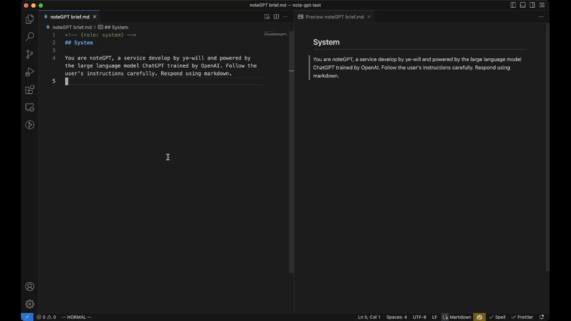

# noteGPT

Chat with GPT and note in markdown.



## Features

- Support OpenAI / Azure OpenAI
- Stream completion
- Support socks5 / https / http proxy

## Usage

1. Open **Command Palette** with `⇧⌘P` or `Ctrl+Shift+P`, select **noteGPT: New dialogue** to create a new dialogue markdown file
2. Create a user message with **noteGPT: New user message**
3. Input the user text after the html comment `<!-- {role: user} -->`
4. Open **Command Palette** and select **noteGPT: Completion**
5. (A OpenAI secret key is required for the first time running completion)
6. Wait for the completion ends
7. Repeat step 2 to step 6

## Advanced

You can add a yaml header in beginning of the markdown file to change some properties for the dialogue.

```markdown
---
model: gpt-4
temperature: 1
---
<!--
role: system
-->
You are ChatGPT, a large language model trained by OpenAI. Follow the user's instructions carefully. Respond using markdown.

<!-- {role: user} -->
## User

...

<!-- {role: assistant} -->
## Assistant

...

<!-- {role: user} -->
## User

...

<!-- {role: assistant} -->
## Assistant

...
```

## Notice

If you use noteGPT with proxy, make sure to turn `Http: Proxy Support (http.proxySupport)` to "fallback" or "off" in vscode settings. Otherwise noteGPT's proxy settings may be override by vscode.
